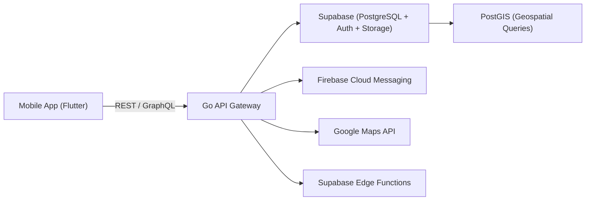
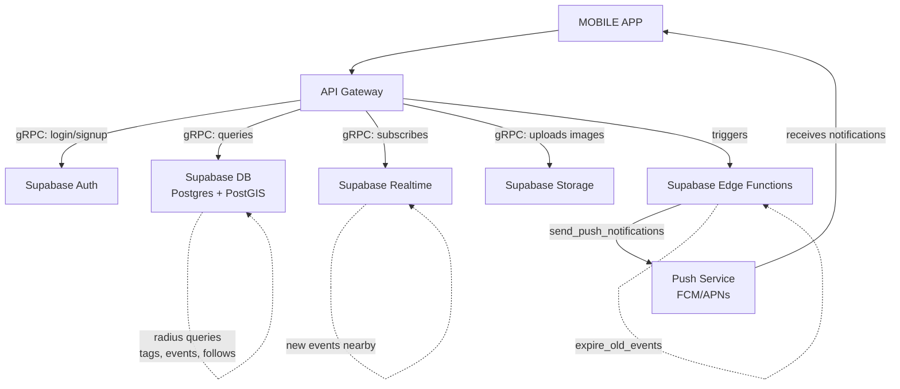
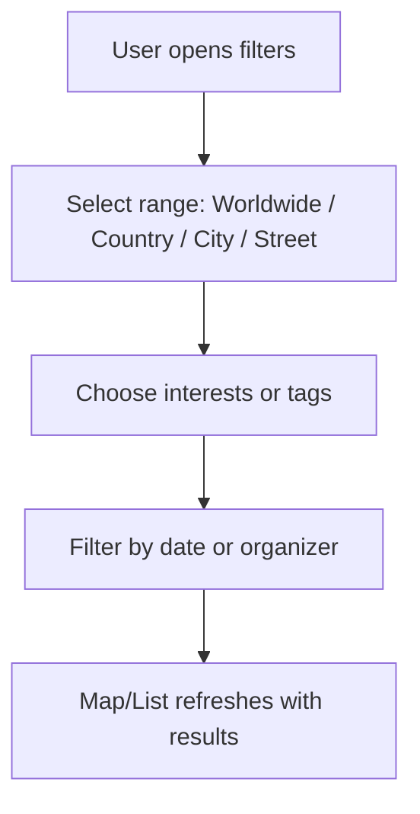
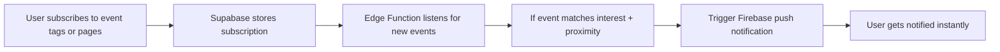
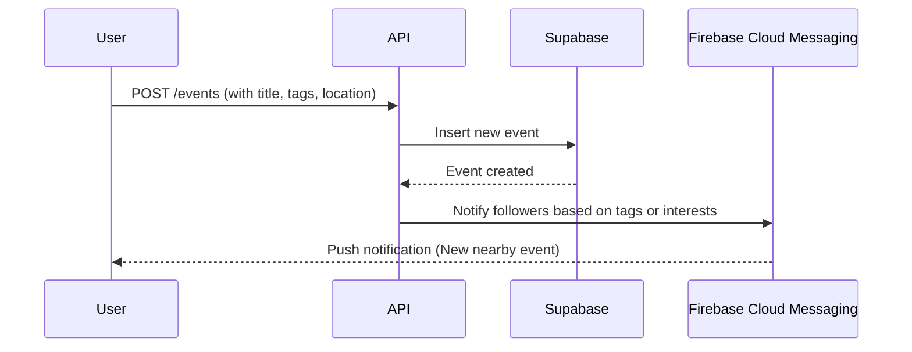

# Eventify — Product Requirements Document (PRD)

---

## 🚀 Quick Start

### Prerequisites
- Flutter SDK installed
- Android Studio / VS Code with Flutter extensions
- Google Maps API key

### Setup Instructions

1. **Clone the repository**
   ```bash
   git clone <repository-url>
   cd echoes
   ```

2. **Install dependencies**
   ```bash
   flutter pub get
   ```

3. **Configure Google Maps API Key**
   
   **Option A: Using local.properties (Recommended)**
   - Open `android/local.properties`
   - Add your Google Maps API key:
     ```properties
     MAPS_API_KEY="YOUR_GOOGLE_MAPS_API_KEY_HERE"
     ```
   
   **Option B: Direct in AndroidManifest.xml**
   - Open `android/app/src/main/AndroidManifest.xml`
   - Replace `${MAPS_API_KEY}` with your actual API key:
     ```xml
     <meta-data 
         android:name="com.google.android.geo.API_KEY"
         android:value="YOUR_GOOGLE_MAPS_API_KEY_HERE"/>
     ```

4. **Run the app**
   ```bash
   flutter run
   ```

> **Note:** Make sure your Google Maps API key has the following APIs enabled:
> - Maps SDK for Android
> - Places API (if using place search)
> - Geocoding API (if using reverse geocoding)

---

## 🧭 Overview

**Eventify** is a geolocation-based event discovery mobile application. It enables users to explore, create, and engage with events happening nearby or in regions they follow. Events are displayed on an interactive map with filtering, following, and reminder functionalities. The app bridges both hyperlocal (e.g., garage sales, uni hackathons) and global events (e.g., concerts, tech expos) to create a unified event discovery experience.

---

## 🎯 Problem Statement

Humans are social beings who thrive on experiences, connections, and exploration. However, discovering events around us — especially in new cities or countries — can be challenging due to fragmented sources and limited visibility. Large platforms like Eventbrite or Facebook Events often spotlight major, monetized gatherings, while smaller or spontaneous events like university hackathons, social clubs, or garage sales remain underexposed.

**Eventify** addresses this by providing a universal map-based event discovery platform where users can explore, filter, and engage with events of all scales — from city festivals to niche local meetups — wherever they are in the world.

---

## 💡 Solution

**Eventify** lets users explore events on a map or list view, filter them based on location, interests, or tags, and receive personalized notifications. Users can create their own events, follow organizers or categories, and seamlessly add events to their calendars.

### Core Functionalities

1. **Create Events** – Users can create and publish events with details like title, description, tags, and expiry time.
2. **Event Notifications** – Get alerts when events matching your interests appear nearby or when followed pages post new events.
3. **Filtering System** – Refine discovery from worldwide to street-wide. Filter by tags, interests, or event type.
4. **Calendar Integration** – Add events to device calendar or set reminders via native Android/iOS APIs.
5. **Map & List Views** – Switch between map-based and list-based event discovery. The list view helps when the map becomes cluttered.
6. **Follow System** – Follow organizers, categories, or tags to stay updated.
7. **Boost System** – Verified users or pages can amplify event reach.
8. **Reporting System** – Report fake, duplicate, or inappropriate events.
9. **Geofence Radius Control** – Adjust the discovery radius for global or local exploration.
10. **Repost / Share Functionality** – Organizations (e.g., universities) can “boost share” events from other verified pages to notify their own followers without creating duplicates.

---

## 📱 Core Features

1. **Interactive Map** – View nearby and global events plotted on an interactive map.
2. **Event Creation & Expiry** – Users can create events (garage sales, meetups, hackathons) with expiration and time-based visibility.
3. **Tags & Filters** – Events can be tagged and filtered by interest (e.g., Music, Tech, Community, Sale).
4. **Follow System** – Follow users, organizations, or categories.
5. **Boost System** – Let verified organizers promote events to their followers.
6. **Geofence Controls** – Discover events within chosen radius or globally.
7. **Reporting System** – Ensure moderation and authenticity through user reports.
8. **Reminders & Calendar Sync** – Add event reminders or sync directly to native calendar.
9. **List View** – Provides an alternate way to view events when the map is cluttered. Displays event cards sorted by proximity, date, or popularity, including key details (title, date, location, and quick actions like Follow, Add to Calendar, or Report).
10. **Boost Share** – Allows verified pages or institutions to share another event with their own followers, expanding reach without duplication.

---

## 🏗️ System Architecture

## 🧱 Tech Stack

| Layer | Technology | Purpose |
|-------|-------------|----------|
| **Frontend** | Flutter | Cross-platform mobile app (Android + iOS) |
| **Backend** | Go | Lightweight, fast API Gateway |
| **Database** | Supabase (PostgreSQL) | Core database for users, events, and media |
| **Geo Engine** | PostGIS | Spatial queries for nearby events |
| **Auth** | Supabase Auth | Email, Google, and Apple Sign-In |
| **Storage** | Supabase Storage | Image uploads for events |
| **Notifications** | Firebase Cloud Messaging | Real-time push notifications |
| **Maps** | Google Maps API | Map visualization and reverse geocoding |
| **Serverless** | Supabase Edge Functions | Triggers and background jobs |

---

---

## 🧱 Architecture Diagram


Here’s how the flow works conceptually:



---

### 🔍 Filtering Logic



### 🔔 Notifications & Preferences



---

## 🧩 Database Design (Supabase / PostgreSQL)

```sql
users(id, name, email, profile_image, location, created_at)
events(id, creator_id, title, description, location(geometry), start_time, end_time, expiry, tags[], created_at)
tags(id, name)
follows(id, follower_id, followed_id, type['user','page','category'])
boosts(id, event_id, booster_id, created_at)
reports(id, reporter_id, event_id, reason, status, created_at)
notifications(id, user_id, event_id, type['new_event','boost','report_update'], seen, created_at)
shares(id, sharer_id, event_id, created_at)
```

### Relationships

* `users` ↔ `events` — one-to-many
* `events` ↔ `tags` — many-to-many
* `users` ↔ `follows` — many-to-many
* `events` ↔ `boosts` — one-to-many
* `events` ↔ `shares` — one-to-many (shared events by pages)

---

## ⚙️ API Routes (Go + Supabase)

| Method | Endpoint           | Description                              |
| ------ | ------------------ | ---------------------------------------- |
| POST   | /auth/signup       | Register a user                          |
| POST   | /auth/login        | Authenticate user                        |
| GET    | /events            | Get events by filters, tags, radius      |
| POST   | /events            | Create new event                         |
| GET    | /events/:id        | Get event details                        |
| POST   | /events/:id/boost  | Boost an event                           |
| POST   | /events/:id/share  | Share another user’s event (boost share) |
| POST   | /events/:id/report | Report an event                          |
| GET    | /user/following    | Get followed pages/categories            |
| POST   | /follow            | Follow user/category                     |
| DELETE | /follow            | Unfollow                                 |
| GET    | /notifications     | Fetch notifications                      |

---

## 🔁 Sequence Diagram — Event Creation & Notification



---

## 🗺️ Wireframes (Frontend)

1. **Home (Map View)**

   * Displays current location and nearby event pins.
   * Floating filters (tags, radius, interests) and toggle for list view.

2. **List View (Alternate)**

   * Displays a scrollable feed of nearby or filtered events.
   * Event cards show: title, thumbnail, distance, category tag, date/time, and quick action buttons (Follow, Add to Calendar, Report).
   * Supports sorting by distance, recency, or popularity.


3. **Event Detail Page**

   * Title, description, date/time, location map.
   * Buttons: Follow, Boost, Add to Calendar, Report, Share.

4. **Create Event Page**

   * Fields for title, description, location picker, tags.
   * Expiry and reminder options.

  
  
5. **Follow Page**

   * Tabs for Pages, Categories, and Users.
   * Follow/Unfollow buttons.

6. **Profile Page**

   * Shows created, shared, and boosted events, and followed pages.

   
---
# GEMINI UI GENERATED IDEA
---
**Profile Page**


**Home Page (map view)**


**Home Page (List view)**


**Event detail Page**


**Creaete Event Page**


---

## 🧠 Design Rationale

* **Supabase (PostgreSQL)** — for relational integrity and PostGIS support.
* **Go API Gateway** — for efficient concurrent request handling.
* **Flutter** — for native-level mobile performance across iOS & Android.
* **FCM + Supabase Realtime** — to support real-time notifications and updates.

---

## 🚀 Future Enhancements

* **AI-based personalized recommendations.**
* **Community badges & verification.**
* **Offline event caching.**
* **Trend-based discovery (“What’s hot nearby”).**
* **Dynamic geofencing for travel-based suggestions.**
* **Event collaboration (multi-host management).**

---

## 🧾 Summary

**Eventify** creates a seamless way to discover, create, and experience events anywhere in the world. From local garage sales to global conferences, users can explore and connect with events that match their interests and proximity. Built using Flutter, Go, and Supabase, Eventify emphasizes discoverability, social engagement, and personalization.

---

